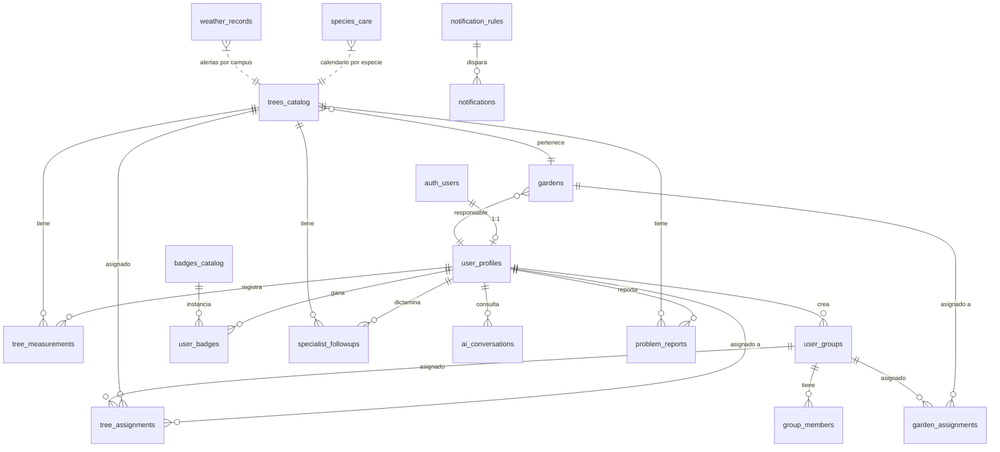

# Arquitectura — Proyecto Árbol UNAM 475

## 1. Visión general

Aplicación web tipo **SPA (Single Page Application)** construida con vanilla JavaScript, sin frameworks, hospedada estáticamente en GitHub Pages. El backend está delegado a **Supabase** (PostgreSQL gestionado + Auth + Storage + Edge Functions Deno). Las integraciones con servicios externos (Gemini, Telegram, OpenWeather) corren en Edge Functions, manteniendo las claves API fuera del frontend.

```
┌────────────────────────────────────────────────────────────────┐
│                         CLIENTE (Browser)                        │
│                                                                  │
│  ┌─────────────┐  ┌────────────┐  ┌─────────────┐  ┌──────────┐ │
│  │ HTML/CSS    │  │ Vanilla JS │  │ ServiceWrkr │  │IndexedDB │ │
│  │ index.html  │  │ (módulos)  │  │ sw.js       │  │offline   │ │
│  └─────────────┘  └────────────┘  └─────────────┘  └──────────┘ │
│         │              │                                          │
└─────────┼──────────────┼──────────────────────────────────────────┘
          │              │
          │              │ HTTPS / WebSocket
          ▼              ▼
┌────────────────────────────────────────────────────────────────┐
│                       SUPABASE PLATFORM                          │
│                                                                  │
│  ┌─────────┐  ┌───────────┐  ┌──────────┐  ┌─────────────────┐ │
│  │ Auth    │  │ PostgREST │  │ Storage  │  │ Edge Functions  │ │
│  │(JWT/PKCE│  │  + RLS    │  │ (photos, │  │ (Deno runtime)  │ │
│  │         │  │           │  │ backups) │  │                 │ │
│  └─────────┘  └─────┬─────┘  └──────────┘  └────────┬────────┘ │
│                     │                                │           │
│                     ▼                                │           │
│              ┌──────────────┐                       │           │
│              │ PostgreSQL   │                       │           │
│              │ + RLS + Trigs│                       │           │
│              └──────────────┘                       │           │
└──────────────────────────────────────────────────────┼───────────┘
                                                       │
                          ┌────────────────────────────┼─────────────┐
                          │ INTEGRACIONES EXTERNAS     │             │
                          ▼                            ▼             ▼
                    ┌──────────┐              ┌────────────┐  ┌──────────┐
                    │ Gemini   │              │ Telegram   │  │OpenWeath.│
                    │  API     │              │  Bot API   │  │  API     │
                    └──────────┘              └────────────┘  └──────────┘
```

---

## 2. Estructura de archivos

### Frontend (raíz del repo, todo se sirve por GitHub Pages)

| Archivo | Tamaño aprox | Responsabilidad |
|---|---|---|
| `index.html` | ~100 KB | Estructura HTML + CSS inline + carga de scripts. Contiene todas las pantallas y modales. |
| `manifest.json` | ~1 KB | Manifest PWA (install, theme color, iconos). |
| `sw.js` | ~3 KB | Service Worker — cacheo del app shell, bypass de Supabase, fallback offline. |
| `js/config.js` | ~1 KB | Constantes Supabase (URL + anon key). Variables globales `currentUser`, `currentUserProfile`. |
| `js/utils.js` | ~5 KB | Utilidades: `showToast`, `showModal`, `escapeHtml`, `safeMd`, `formatDate`, `compressImageForAI`. |
| `js/auth.js` | ~10 KB | `initApp`, `handleLogin`, `handleLogout`, `loadUserProfile`, `showForgotPassword`, `sendPasswordReset`, `handleDeepLink` (QR), `registerServiceWorker`, modal de perfil. |
| `js/navigation.js` | ~3 KB | `showSection` (cambio de secciones), `setupRoleBasedNav`. |
| `js/mi-arbol.js` | ~30 KB | Vista del árbol asignado. Tabs Info / Seguimiento / Nuevo Registro / Metas. Incluye captura de plantación con GPS+mapa, rúbrica de salud de 10 puntos, gráfica temporal, badges, calendario de cuidados, reporte ciudadano. |
| `js/pumai.js` | ~10 KB | Chat con Gemini para diagnóstico. Compresión de imagen, subida, render seguro de markdown. |
| `js/ar-height.js` | ~20 KB | Medición AR de altura mediante giroscopio. Modo tap-to-place y fallback manual. |
| `js/admin.js` | ~50 KB | Panel admin de 9 pestañas: Usuarios, Árboles, Jardines, Grupos, Notificaciones, Asignaciones, Dashboard, Reportes Ciudadanos, Auditoría. CRUD completo + QR + exports. |
| `js/offline-queue.js` | ~3 KB | IndexedDB queue + sync al volver online. |

### Backend (`supabase-functions/` — no se sube a GitHub Pages)

| Archivo | Despliegue |
|---|---|
| `01-hardening.sql` | SQL Editor (uno solo, idempotente) |
| `02-innovations.sql` | SQL Editor (después del 01) |
| `create-user/index.ts` | Edge Function `create-user` |
| `send-telegram-notification/index.ts` | Edge Function `send-telegram-notification` |
| `notification-cron/index.ts` | Edge Function `notification-cron` |
| `weather-sync/index.ts` | Edge Function `weather-sync` |
| `backup-export/index.ts` | Edge Function `backup-export` |
| `pum-ai` (legacy) | Función ya desplegada — no incluida en este repo |

---

## 3. Modelo de datos (PostgreSQL)

### Tablas principales



### Tablas (resumen)

| Tabla | Filas típicas | Propósito |
|---|---|---|
| `user_profiles` | 1 fila por usuario | Datos extendidos del usuario (nombre, rol, campus, telegram_chat_id, especialidad si aplica) |
| `trees_catalog` | 1 fila por árbol | Inventario maestro de árboles con metadata, ubicación y salud actual |
| `tree_measurements` | N filas por árbol | Cada seguimiento de un árbol (foto, medidas, rúbrica, ubicación si es primer registro) |
| `tree_assignments` | M:N árbol↔usuario/grupo | Quién es responsable de cada árbol |
| `gardens` | 1 fila por jardín | Áreas verdes con metadata (suelo, riego, exposición, especialista responsable) |
| `garden_assignments` | M:N jardín↔usuario/grupo | Asignaciones a nivel jardín |
| `user_groups` + `group_members` | Agrupaciones | Para asignaciones colectivas y notificaciones |
| `specialist_followups` | Por especialista | Dictamen profesional sobre un árbol |
| `notifications` | Por destinatario | Bandeja de notificaciones in-app |
| `notification_rules` | Reglas configurables | Define cuándo se disparan alertas automáticas |
| `ai_conversations` | Por consulta | Histórico de chat con PUM-AI |
| `problem_reports` | Reportes ciudadanos | Quejas/incidencias sobre árboles, vía QR |
| `audit_log` | Por acción admin | Trazabilidad inmutable de todos los cambios |
| `badges_catalog` | 8 filas | Catálogo de insignias |
| `user_badges` | Por usuario | Insignias ganadas |
| `weather_records` | Por campus×día | Datos meteorológicos diarios |
| `species_care` | Por especie×mes×tarea | Calendario de cuidados |

Detalle completo de columnas y constraints en [API Reference](05-API-REFERENCE.md).

---

## 4. Seguridad — RLS (Row Level Security)

Cada tabla tiene RLS **habilitado** y políticas estrictas:

| Patrón | Tablas |
|---|---|
| **Admin all + owner own** | `user_profiles`, `tree_measurements`, `notifications` |
| **Admin all + assigned only** | `trees_catalog`, `tree_assignments`, `garden_assignments` |
| **Admin only** | `audit_log`, `notification_rules` |
| **Authenticated read** | `gardens`, `user_groups`, `badges_catalog`, `species_care`, `weather_records` |
| **Owner-based** | `ai_conversations`, `problem_reports`, `specialist_followups` |

La función helper `is_admin()` (SECURITY DEFINER) chequea `user_profiles.role = 'admin'` para el `auth.uid()` actual.

Detalle completo en [Seguridad](07-SEGURIDAD.md).

---

## 5. Triggers y funciones DB

| Trigger | Tabla | Cuándo | Qué hace |
|---|---|---|---|
| `update_updated_at` | trees_catalog, gardens, user_profiles | BEFORE UPDATE | Actualiza `updated_at = now()` |
| `audit_*` | trees_catalog, user_profiles, gardens, tree_assignments | AFTER INSERT/UPDATE/DELETE | Inserta fila en `audit_log` con before/after |
| `recompute_badges_meas` | tree_measurements | AFTER INSERT | Recalcula y otorga insignias al usuario |

Funciones útiles:
- `is_admin()` — check de rol
- `recompute_badges(user_id)` — recálculo manual de insignias
- `trees_within_radius(lat, lng, radius_m)` — RPC para encontrar árboles cercanos (Haversine)
- `log_audit()` — escribe en audit_log

---

## 6. Edge Functions (Deno)

| Función | Dispara | Acceso | Propósito |
|---|---|---|---|
| `create-user` | Admin invoca | Auth (admin) | Crea usuario en `auth.users` + perfil. Usa service_role para bypass RLS. |
| `send-telegram-notification` | Admin invoca | Auth (admin) | Envía mensaje a Telegram a usuario/grupo/broadcast. Persiste en `notifications`. |
| `notification-cron` | pg_cron diario | Service role | Recorre `notification_rules` activas y dispara alertas (stale 30d, health drop, frost). |
| `weather-sync` | pg_cron diario | Service role | Llama a OpenWeather y guarda en `weather_records`. |
| `backup-export` | pg_cron semanal | Service role | Exporta JSON de tablas críticas a bucket `backups`. Retención 90d. |
| `pum-ai` | User invoca | Auth | Proxy a Gemini API para chat y análisis de imágenes. |

Las Edge Functions usan:
- `Authorization: Bearer <jwt>` para identificar al caller
- Fallback de decodificación manual de JWT (resistente a rotación de algoritmo)
- `SUPABASE_SERVICE_ROLE_KEY` para escrituras privilegiadas
- Validación de rol admin antes de operaciones críticas

---

## 7. Flujos críticos

### 7.1 Login

```
Usuario → Login → sb.auth.signInWithPassword
                ↓
             Sesión JWT (almacenada en localStorage)
                ↓
             loadUserProfile() → user_profiles
                ↓
             setupRoleBasedNav(role) → muestra/oculta nav
                ↓
             showMainApp() → showSection('section-mi-arbol')
                ↓
             handleDeepLink() → si ?t=<code> → ir al árbol
                ↓
             OfflineQueue.syncPending() → sube mediciones encoladas
```

### 7.2 Alta de árbol (admin)

```
Admin llena form → saveAdminTree()
                 ↓
             Validación: tree_code + species + status válido
                 ↓
             INSERT trees_catalog (sin lat/lng)
                 ↓
             Trigger audit_* → audit_log
                 ↓
             loadAdminTrees() → refresca tabla
```

### 7.3 Primer seguimiento (usuario)

```
Usuario abre Mi Árbol → loadMyTree()
                      ↓
             Detecta meas.length === 0 → renderiza form de PLANTACIÓN
                      ↓
             Usuario captura GPS o ingresa lat/lng → updatePlantingMap()
                      ↓
             Submit → saveMeasurement()
                      ↓
             Si online: INSERT tree_measurements
                      ↓
             Trigger recompute_badges → user_badges (first_measurement, planter)
                      ↓
             UPDATE trees_catalog SET location_lat/lng/planting_date/status='activo'
                      ↓
             loadMyTree(true) → refresca vista
```

### 7.4 QR scan (ciudadano)

```
Persona escanea QR del árbol con celular
              ↓
URL: https://app/?t=ARBOL-001 (o ?report=ARBOL-001)
              ↓
Browser abre app → sw.js sirve index.html (incluso offline)
              ↓
initApp() → loadUserProfile()
              ↓
showMainApp() → handleDeepLink()
              ↓
SELECT trees_catalog WHERE tree_code = 'ARBOL-001'
              ↓
Si ?t=  → showSpecialistTree(treeId)
Si ?report= → openCitizenReport(treeId)
              ↓
Usuario llena form de reporte → INSERT problem_reports
              ↓
Trigger badges → 'citizen_reporter' otorgado
```

### 7.5 Notificación automática (cron)

```
pg_cron 7 AM UTC → llama notification-cron Edge Function
              ↓
SELECT notification_rules WHERE enabled=true
              ↓
Para cada regla:
  - 'stale_measurement_30d': busca árboles sin medición en 30 días → notifica al usuario asignado
  - 'health_drop_20pts': busca árboles con caída de salud → notifica admin + especialista del jardín
  - 'weather_frost_alert': consulta weather_records de hoy → notifica usuarios del campus afectado
              ↓
Para cada destinatario:
  - INSERT notifications (in-app)
  - Si telegram_active && telegram_chat_id → fetch Telegram Bot API
              ↓
Devuelve summary { rule_key: count_sent }
```

---

## 8. Service Worker y modo offline

`sw.js` cachea el **app shell** (HTML, JS, manifest) la primera vez. En requests posteriores:
- **Misma origen / CDN**: network-first con fallback a cache
- **Supabase API**: nunca cachea, va siempre a la red

Cuando el usuario está offline y guarda una medición:
1. `saveMeasurement` detecta `!navigator.onLine`
2. Encola payload en IndexedDB (`OfflineQueue.enqueue`)
3. Toast informa al usuario que está pendiente de sync
4. Al evento `online`, `OfflineQueue.syncPending()` reenvía e insertan en BD

---

## 9. Integraciones externas

### Google Gemini (PUM-AI)
- Vía Edge Function `pum-ai` (no incluida en este repo, fue creada antes)
- Modos: chat de texto, análisis de foto, evaluación de rúbricas auto
- API key vive como secret de Edge Function

### Telegram (`@Pumai_treebot`)
- Bot creado con BotFather
- Token en secret `TELEGRAM_BOT_TOKEN`
- Cada usuario debe registrar su `chat_id` en su perfil para recibir mensajes
- API: https://core.telegram.org/bots/api

### OpenWeather
- API gratuita (60 calls/min)
- API key en secret `OPENWEATHER_API_KEY`
- Endpoint: `forecast` para 24h adelante, agrupado por campus

### OpenStreetMap
- Tiles de mapa para Leaflet, sin API key
- Atribución requerida (ya incluida en el render)

---

## 10. Performance y escalabilidad

| Punto | Implementación |
|---|---|
| Imágenes pesadas | Compresión client-side antes de upload (1200×1200, JPEG 80%) |
| Fotos privadas | Storage bucket privado + signed URLs con TTL 1h |
| Listas grandes | Paginación en backups; queries con `.limit()` en frontend |
| Cache | Service Worker para app shell, IndexedDB para offline queue |
| Bundle | Sin bundler — scripts cargan secuencialmente desde CDN |

**Límites prácticos**: hasta ~10,000 árboles y ~100,000 mediciones la app funciona bien. Más allá, considerar:
- Paginación en `loadAdminTrees`
- Materializar agregados (avg_health por jardín)
- Mover charts a server-side rendering

---

## 11. Decisiones de diseño

- **Vanilla JS sin framework**: minimiza dependencias, fácil de mantener para estudiantes/voluntarios sin entrenamiento en React/Vue.
- **Supabase**: backend completo gestionado, evita operar Postgres + Auth + Storage por separado.
- **Edge Functions Deno**: corren cerca del usuario, sin servidor propio.
- **GitHub Pages**: hosting estático gratuito, suficiente para SPA.
- **PWA**: install + offline sin tener que ir a App Store/Play Store.
- **AR sin ARKit/ARCore**: solo gyroscope + cálculo trigonométrico. No requiere apps nativas.
- **Datos en BD vs hardcoded**: especialistas son `user_profiles` (no array fijo); calendario de cuidados es `species_care` (editable).

---

## 12. Diagrama de componentes

```
┌────────────────────────────────────────────────────────────────────────┐
│                              FRONTEND (SPA)                              │
│                                                                          │
│  ┌────────┐  ┌──────────┐  ┌──────────┐  ┌──────────┐  ┌──────────┐    │
│  │ Login  │  │MiArbol   │  │ Info     │  │ PUM-AI   │  │Especialis│    │
│  │        │  │(seguim.) │  │(catálogo)│  │ (chat)   │  │(dictamen)│    │
│  └────────┘  └──────────┘  └──────────┘  └──────────┘  └──────────┘    │
│       │           │             │             │             │            │
│       │           ▼             │             │             │            │
│       │     ┌──────────┐        │             │             │            │
│       │     │ AR Height│        │             │             │            │
│       │     └──────────┘        │             │             │            │
│       │                                                                  │
│  ┌────▼─────────────────────────────────────────────────────────────┐  │
│  │                      ADMIN PANEL (admin.js)                       │  │
│  │  Users · Trees · Gardens · Groups · Notif · Assign · Dashboard ·  │  │
│  │  Reportes · Auditoría                                              │  │
│  └────────────────────────────────────────────────────────────────────┘ │
│                                                                          │
│  Servicios cross-cutting: auth.js · navigation.js · utils.js ·          │
│  offline-queue.js · sw.js                                               │
└──────────────────────────────────────┬─────────────────────────────────┘
                                       │
                          ┌────────────┴────────────┐
                          │                         │
                          ▼                         ▼
            ┌─────────────────────┐    ┌──────────────────────┐
            │   Supabase REST     │    │   Edge Functions     │
            │   (PostgREST + RLS) │    │   (Deno)             │
            └──────────┬──────────┘    └──────────┬───────────┘
                       │                          │
                       ▼                          ▼
            ┌──────────────────────────────────────────┐
            │           PostgreSQL                       │
            │  + RLS + triggers + audit + funciones      │
            └──────────────────────────────────────────┘
```

---

## 13. Referencias cruzadas

- Tablas y campos: [API Reference](05-API-REFERENCE.md)
- Cómo desplegar: [Deployment](06-DEPLOYMENT.md)
- Modelo de seguridad: [Seguridad](07-SEGURIDAD.md)
- Solución de problemas: [Troubleshooting](08-TROUBLESHOOTING.md)
